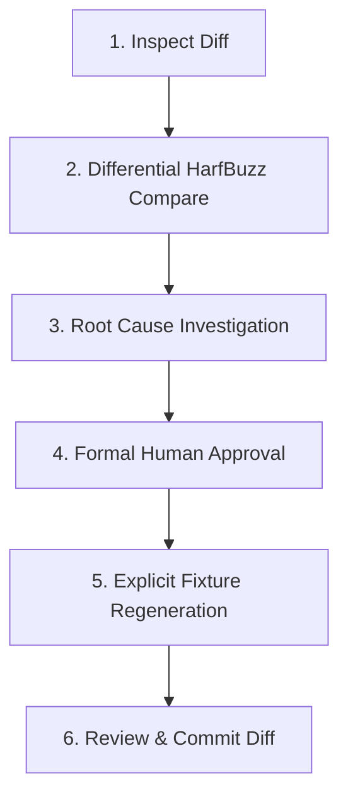

# Golden Testing & Fixture Update Procedure

## 1. Corpus Distinction & Invariants

This package maintains two distinct fixture corpuses:
1. **206 Retained HarfBuzz Golden Fixtures** (`test/fixtures/khmer_golden_fixtures.json`):
   - Stable, release-quality evidence representing all 20 orthographic categories of the Khmer Unicode standard.
   - Verified across HarfBuzz differential shaping and macOS PDFKit 100% exact semantic extraction.
   - **Strict Invariant**: These fixtures are immutable release baselines. Normal test runs NEVER regenerate them.
2. **805 Generated Differential Stress Cases** (`test/fixtures/khmer_stress_corpus.json`):
   - Broad generated differential stress coverage testing complex syllable permutations against HarfBuzz.

---

## 2. Oracle Provenance & Font Binding

- **Original Generator Version**: `hb-shape (HarfBuzz) 14.2.1` via `tool/generate_fixtures.py`
- **Validation Oracle Version**: `HarfBuzz 14.2.1` (verified with system `hb-shape` and native differential harness)
- **Experimental FFI Reference**: `HarfBuzz 14.2.1` (dylib FFI spike used in Phase 3 differential validation)
- **Font File**: `Battambang-Regular.ttf`
- **Exact Font SHA-256**:
  `c7d867c7d4e8371f23678bd12cd1700cab1e4e37ec2860eb439766142b240bd9`
- **Shaping Configuration**:
  - Script: Khmer (`khmr`)
  - Direction: Left-to-Right (`ltr`)
  - Language: Default (`km`)
  - OpenType Features: `locl`, `ccmp`, `pref`, `blwf`, `abvf`, `pstf`, `pres`, `blws`, `abvs`, `psts`, `clig`, `kern`
- **Generator**: `tool/generate_fixtures.py`

If the font binary SHA-256 differs from `c7d867c7d4e8371f23678bd12cd1700cab1e4e37ec2860eb439766142b240bd9`, the test suite fails immediately.

---

## 3. Strict 6-Step Golden Update Procedure

When a golden test fails, **DO NOT** use automated snapshot overwrite scripts or blindly accept changes.

Follow this required procedure:



### Step 1: Inspect the Difference
Run the differential validator and inspect the exact glyph ID, cluster, advance, or offset mismatch:
```bash
flutter test test/harfbuzz_differential_test.dart
```

### Step 2: Compare Against HarfBuzz Reference
Run the external HarfBuzz CLI directly on the failing string with the exact font:
```bash
hb-shape assets/fonts/Battambang-Regular.ttf --script=khmr --direction=ltr "<failing_text>"
```

### Step 3: Determine Root Cause
Determine whether:
- The Dart GSUB shaping engine has a regression or bug.
- HarfBuzz upstream behavior changed across versions.
- The Unicode input string has malformed orthography.

### Step 4: Explicit Approval
If and only if the change is a verified correctness fix aligned with HarfBuzz reference shaping, obtain architectural sign-off.

### Step 5: Explicit Regeneration
Regenerate the fixture data using the dedicated generator tool (never via unit test execution):
```bash
python3 tool/generate_fixtures.py
```

### Step 6: Review Resulting Git Diff
Verify that only the intended fixture entries changed in `test/fixtures/khmer_golden_fixtures.json`:
```bash
git diff test/fixtures/khmer_golden_fixtures.json
```
